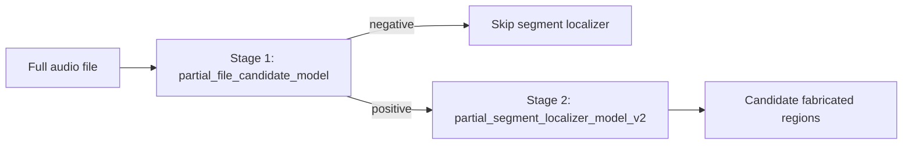

# Phase 9D-P5 Partial Fabrication Redesign — Design

## Purpose

Phase 9D-P4 showed ranking signal in the current partial segment model but **zero localized success** and **universal broad activation** across fabricated files. Live partial localization cannot proceed on the existing single-stage segment model alone.

Phase 9D-P5A defines datasets and validation for a **two-stage partial fabrication live design** without training any models.

## P4 findings (motivation)

| Finding | Implication |
|---------|-------------|
| Top-5 timestamp hit 36/46 | Model ranks true region segments reasonably often |
| localized_success_count = 0 | No file passes conservative localization criteria |
| broad_activation_count = 46/46 | Most segments activate — prevents precise localization |
| Human fabricated > AI fabricated (top-5) | Category-specific calibration may be needed in P5B |

## Two-stage architecture



### Stage 1 — File-level partial candidate gate

**Model name (future):** `partial_file_candidate_model`

**Question:** Does this full audio likely contain partial fabrication?

**Dataset:** `phase9d_p5_file_partial_gate_dataset.csv`

| Class | Categories |
|-------|------------|
| Positive (`target_is_partial_fabrication_file=1`) | ai_fabricated, human_fabricated |
| Negative (`target_is_partial_fabrication_file=0`) | ai_direct, human_direct, ai_replay/repeat, human_replay/repeat, ai_mixer, human_mixer |

**Features (live-computable only):**

- File acoustic features from Phase 8C / Phase 8E0 master
- File SSL embeddings (`ssl_emb_*`)
- Optional live summary stats from segment diagnostics (only if computable without timestamps)

**Excluded from features:**

- Timestamp start/end values
- Target columns and label fields
- `file_category`, `known_manipulation_labels` as model inputs

### Stage 2 — Improved segment localizer v2

**Model name (future):** `partial_segment_localizer_model_v2`

**Question:** If the file-level gate is positive, which segments are likely fabricated?

**Dataset:** `phase9d_p5_segment_partial_localizer_dataset.csv`

| Row type | `segment_source_type` | Target |
|----------|----------------------|--------|
| Inside fabricated region | fabricated_inside | 1 |
| Outside same partial file | fabricated_outside_same_file | 0 |
| Direct clean files | clean_direct_negative | 0 |
| Replay/repeat files | replay_negative | 0 |
| Mixer files | mixer_negative | 0 |

**Features (live-computable only):**

- Segment acoustic features
- Segment SSL embeddings
- Safe within-file localization features (median deviation, neighbor transition — no timestamp baselines)

**Excluded from features:**

- All timestamp overlap fields
- Fabrication direction, region labels, targets
- Prior partial model probabilities as default features
- Inside/outside baseline margins from supervised timestamp splits

## Timestamp policy

Timestamps are loaded from:

- `data/phase7c1/raw/ai_fabricated/insertion_stamps.csv`
- `data/phase7c1/raw/human_fabricated/insertion_stamps.csv`

**Allowed uses:**

- Identify which files are partial-fabrication positives
- Construct segment targets (`target_is_fabricated_segment`)
- Evaluation metadata and audit (`phase9d_p5_timestamp_target_audit.csv`)

**Forbidden uses:**

- Model input features at file or segment level
- Live inference features in Phase 9C/9E pipeline

Matching keys: exact `audio_path`, `output_file`, basename, normalized stem.

## Negative sampling

CLI controls on assembly script:

| Argument | Default | Description |
|----------|---------|-------------|
| `--max_negative_segments_per_category` | 1000 | Cap per negative source type |
| `--negative_sample_strategy` | `cap_per_category` | `all`, `balanced_by_positive`, `cap_per_category` |
| `--overlap_threshold` | 0.25 | Segment overlap ratio for positive label |
| `--random_seed` | 42 | Reproducible sampling |

All positive segments are retained; negatives are sampled per strategy.

## Leakage prevention

Outputs:

- `phase9d_p5_feature_leakage_audit.csv` — forbidden column audit per dataset
- `phase9d_p5_file_gate_feature_columns.json`
- `phase9d_p5_segment_localizer_feature_columns.json`
- `model_feature_columns_json` column in each dataset row (same list for all rows)

## Scripts

| Script | Role |
|--------|------|
| `code/phase9/partial_redesign/assemble_phase9d_p5_partial_datasets.py` | Build datasets and reports |
| `code/phase9/partial_redesign/phase9d_p5_partial_utils.py` | Shared helpers |
| `code/phase9/partial_redesign/validate_phase9d_p5_partial_datasets.py` | Pre-training validation |

## User execution (manual)

```text
python code/phase9/partial_redesign/assemble_phase9d_p5_partial_datasets.py
python code/phase9/partial_redesign/validate_phase9d_p5_partial_datasets.py
```

## Constraints (this phase)

- **No model training, packaging, or inference**
- **Do not modify** Phase 8 source outputs or Phase 9B packaged models
- **Do not create** `fake_score`, `real_score`, or final fake/real decisions
- **Phase 9E NOT STARTED**

## Next phase

**Phase 9D-P5B** — Train and evaluate file-level partial gate + segment localizer v2 on these datasets.
