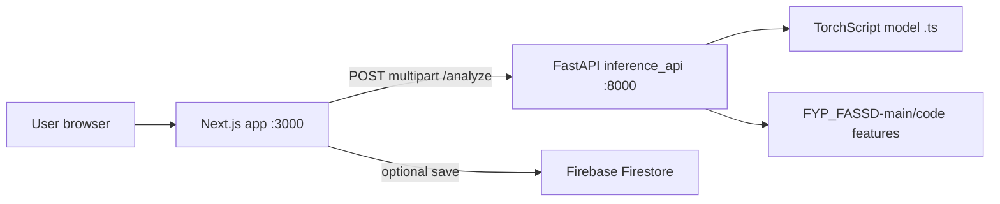

# FASSD — Partner integration guide

> **⚠️ OUTDATED — Legacy Hybrid ResNet stack.** This document describes an **earlier** integration (binary Hybrid ResNet + `inference_api/`).  
> **Current production (May–Jun 2026):** Phase 9 multi-axis API + Next.js at https://www.deepfakedetection.dev/ — see **`thesis_working_notes/FRONTEND_AND_DEPLOYMENT_STORY.md`** (authoritative).  
> **Website repo:** separate git repository (documented path `D:\FASSD\`) — not the FYP ML repo (`E:\FYP`).

This document explains what was built in the **legacy** phase: how the Next.js website talked to a **Hybrid ResNet** inference API.

**Last updated:** May 2026 (superseded for production by Phase 9 deployment doc above)  
**Repo root:** `D:\FASSD` (separate hosting repository)

---

## 1. Big picture



| Piece | Role |
|--------|------|
| **Next.js (`D:\FASSD`)** | Login, dashboard upload UI, shows results and explanations |
| **`inference_api/`** | Loads the trained hybrid model, runs Phase-6-style chunking + scoring, returns JSON |
| **`FYP_FASSD-main/code/`** | Original training code; **environmental feature extractor** is imported at runtime |
| **`model/hybrid_resnet_environmental_best.ts`** | Exported TorchScript model used by the API (not the raw `.pth` checkpoint) |
| **Firebase** | Auth + optional history of analyses (permissions must be configured in Firebase console) |

The website **no longer uses random/mock detection** on the dashboard. Upload → real API call → map JSON into the UI.

---

## 2. Repository layout (what matters)

```
D:\FASSD\
├── app/                          # Next.js App Router pages
│   ├── dashboard/page.tsx        # Main detection flow (wired to API)
│   ├── profile/page.tsx          # User profile / history (Firestore)
│   ├── signin/, signup/          # Auth pages
│   └── page.tsx                  # Landing
├── components/
│   ├── detection-results.tsx     # Results UI (badges, explanations, raw metrics)
│   ├── upload-zone.tsx           # Drag-and-drop upload
│   └── ...
├── lib/
│   ├── firebase.ts               # Firebase client init
│   ├── firestore.ts              # saveAudioAnalysis, getAudioHistory, etc.
│   └── auth-context.tsx          # Auth provider
├── inference_api/
│   ├── app/main.py               # FastAPI app (all inference logic)
│   └── requirements.txt
├── model/
│   └── hybrid_resnet_environmental_best.ts
├── FYP_FASSD-main/               # Original FYP project (training, phase6 scripts)
│   └── code/phase6/explain_prediction.py   # Offline CLI (reference implementation)
└── PARTNER_INTEGRATION_GUIDE.md  # This file
```

---

## 3. Backend (`inference_api`)

### 3.1 What it does

For each uploaded audio file:

1. **Decode** audio with librosa (16 kHz mono). On Windows, the file is written to a temp path, **closed**, then loaded (avoids “Permission denied” on temp `.wav`).
2. **Chunk** audio (default 4 s windows, 1 s overlap).
3. **VAD gating** — keeps chunks with enough speech (file-level RMS percentile or absolute dB threshold). If none pass, falls back to all chunks.
4. Per chunk:
   - **Log-mel spectrogram** 64×400 (same params as Phase 2 / training).
   - **12-D environmental features** via `EnvironmentalFeatureExtractor` from `FYP_CODE_ROOT` (if available).
5. **Model forward** — TorchScript (or ONNX) returns binary logits + 4-class attack logits.
6. **Pool chunk scores** into one file-level decision (`POOLING`, default `pct_vote`).
7. **Threshold** — compare decision score to `VOTE_THRESHOLD` (for `pct_vote`) or `THRESHOLD` (other pooling modes).
8. Build **human-readable explanations** (env reasons, spec/pooling/VAD reasons, overall text).

This mirrors **`FYP_FASSD-main/code/phase6/explain_prediction.py`** for the core pipeline. The API does **not** call that script; logic was ported into `inference_api/app/main.py`.

### 3.2 API endpoints

| Method | Path | Description |
|--------|------|-------------|
| `GET` | `/health` | Service status, whether model and env extractor loaded |
| `POST` | `/analyze` | `multipart/form-data` field `file` → full JSON result |

**Client URL:** use `http://localhost:8000` in the browser (not `http://0.0.0.0:8000`).

### 3.3 Main JSON fields returned by `/analyze`

| Field | Meaning |
|--------|---------|
| `prediction` | `"REAL"` or `"FAKE"` (file-level verdict) |
| `confidence` | 0–1 margin to threshold (higher = more confident in that verdict) |
| `decision_score` | Score used for pooling (for `pct_vote` = fraction of chunks above chunk threshold) |
| `effective_threshold` | Threshold actually used |
| `pooling` | e.g. `pct_vote` |
| `spoof_prob_mean`, `spoof_prob_median`, `spoof_prob_trimmed`, `spoof_prob_logit_mean` | Chunk spoof statistics |
| `pct_chunks_above_chunk_threshold` | Vote ratio for `pct_vote` |
| `chunk_threshold`, `vote_threshold` | Config used |
| `attack_type` | Top class name: `bonafide`, `synthesis`, `conversion`, `replay` |
| `attack_probs` | Length-4 list of mean multiclass probabilities |
| `n_chunks_total`, `n_chunks_used` | Chunk counts before/after VAD |
| `env_features` | Aggregated raw env metrics (median over chunks) |
| `env_reasons` | Bullet-style env explanation strings |
| `spec_reasons` | Pooling / VAD / threshold explanation strings |
| `overall_explanation` | Short summary sentence |
| `filename`, `duration_s`, `processing_time_s` | Metadata |

### 3.4 Environment variables (backend)

Set these in PowerShell before starting uvicorn:

| Variable | Typical value | Purpose |
|----------|----------------|---------|
| `FYP_CODE_ROOT` | `D:\FASSD\FYP_FASSD-main\code` | Import `EnvironmentalFeatureExtractor` |
| `MODEL_PATH` | `D:\FASSD\model\hybrid_resnet_environmental_best.ts` | TorchScript model file |
| `CORS_ALLOW_ORIGINS` | `http://localhost:3000` | Allow frontend origin |
| `POOLING` | `pct_vote` | Long-audio voting (Phase 6 recommendation) |
| `CHUNK_THRESHOLD` | `0.65` | Per-chunk spoof threshold for voting |
| `VOTE_THRESHOLD` | `0.70` | File passes as FAKE if vote ratio ≥ this |
| `VAD_RMS_PERCENTILE` | `40` | File-level RMS gate |
| `VAD_MIN_SPEECH_RATIO` | `0.40` | Min speech in chunk to keep it |
| `DEVICE` | `cpu` | `cpu` or `cuda` |

See `inference_api/app/main.py` (`Settings` dataclass) for full list: `OVERLAP`, `BATCH_SIZE`, `TRIM_FRACTION`, `VAD_MODE`, etc.

### 3.5 How to run the backend

```powershell
cd D:\FASSD\inference_api
python -m venv .venv
.\.venv\Scripts\Activate.ps1
pip install -r requirements.txt

$env:FYP_CODE_ROOT="D:\FASSD\FYP_FASSD-main\code"
$env:MODEL_PATH="D:\FASSD\model\hybrid_resnet_environmental_best.ts"
$env:CORS_ALLOW_ORIGINS="http://localhost:3000"
$env:POOLING="pct_vote"
$env:CHUNK_THRESHOLD="0.65"
$env:VOTE_THRESHOLD="0.70"
$env:VAD_RMS_PERCENTILE="40"

.\.venv\Scripts\python -m uvicorn app.main:app --host 0.0.0.0 --port 8000
```

Health check:

```powershell
curl http://localhost:8000/health
```

Expect `"model_loaded": true` and `"env_extractor_enabled": true`.

**Notes:**

- Install **FFmpeg** on PATH for some `.m4a` / `.mp3` decodes.
- If `torch==...+cu121` fails in pip, install CPU torch from PyTorch’s index, then `pip install -r requirements.txt`.

### 3.6 Backend vs Phase 6 CLI (`explain_prediction.py`)

| Topic | Phase 6 CLI | Live API |
|--------|-------------|----------|
| Model load | PyTorch `.pth` checkpoint | TorchScript `.ts` |
| Default pooling | CLI default `median` | Env default `pct_vote` |
| Chunk consistency text in `spec_reasons` | Yes (`_spec_reasoning`) | **Not included** (only pooling/VAD lines) |
| `debug_chunk_stats` | Optional flag | Not exposed |
| Batch JSON/CSV to disk | Yes | No (single request/response) |

To match CLI numbers, align env vars with the CLI run (see `FYP_FASSD-main/code/phase6/README.md`).

---

## 4. Frontend (Next.js)

### 4.1 Environment

Create or edit `.env.local` in repo root:

```env
NEXT_PUBLIC_INFERENCE_URL=http://localhost:8000

# Firebase (from Firebase Console)
NEXT_PUBLIC_FIREBASE_API_KEY=...
NEXT_PUBLIC_FIREBASE_AUTH_DOMAIN=...
NEXT_PUBLIC_FIREBASE_PROJECT_ID=...
# ... etc.
```

See `.env.example` for Firebase variable names.

### 4.2 How to run the frontend

```powershell
cd D:\FASSD
npm install
npm run dev
```

Open **http://localhost:3000**. Dashboard is typically **`/dashboard`** (protected route — sign in first).

### 4.3 Dashboard flow (`app/dashboard/page.tsx`)

1. User uploads audio via **`UploadZone`**.
2. Frontend `POST`s file to `{NEXT_PUBLIC_INFERENCE_URL}/analyze`.
3. Response JSON is mapped into UI state:
   - `prediction === "FAKE"` → `isDeepfake: true`
   - Explanations → `overallExplanation`, `envReasons`, `specReasons`
   - Scores → `rawMetrics` object
4. **`verdictKind`** is computed on the frontend for clearer UX:
   - **`clear_bonafide`** — REAL and multiclass agrees (top class bonafide), not near threshold
   - **`clear_spoof`** — FAKE and heads agree, not near threshold
   - **`borderline`** — score within 0.05 of threshold **or** binary verdict disagrees with multiclass argmax
5. If user is logged in, **`saveAudioAnalysis`** writes summary to Firestore (failures are logged only; UI still shows results).

### 4.4 Results UI (`components/detection-results.tsx`)

What the user sees:

| UI label | Meaning |
|----------|---------|
| **Model: bonafide-like** | File-level **REAL** (not spoof-like) |
| **Model: spoof-like** | File-level **FAKE** |
| **Borderline / inconclusive** | Uncertain: near threshold or heads disagree |
| **Model attack hint: …** | Auxiliary 4-class head (not the main verdict) |
| **Multiclass head (auxiliary): peaks at …** | Shown in borderline case with extra disclaimer |
| **Model confidence** | Backend `confidence` as % |
| **Explanation** | `overall_explanation` + env/spec bullet lists |
| **Raw API Metrics** | Pooling, thresholds, spoof stats, attack prob bars |
| **Detailed Analysis** | Progress bars derived from real backend fields (not random) |

**Important:** Labels are intentionally cautious (“model”, “bonafide-like”) — not legal proof of authenticity.

### 4.5 Upload component fix (`components/upload-zone.tsx`)

Upload progress no longer calls `onFileUpload` inside a React `setState` updater (fixes “Cannot update a component while rendering” warning). Callback runs via `setTimeout` after progress hits 100%.

### 4.6 Firebase / Firestore

- **`lib/firestore.ts`**: `saveAudioAnalysis`, `getAudioHistory`, `getForensicReport`
- Collection: `audioAnalyses`
- Saved fields: filename, size, duration, `isDeepfake`, confidence, attackType, processingTime, `details` bars — **not** full API JSON (no env_reasons in DB unless extended later)
- If rules deny write (“Missing or insufficient permissions”), detection still works; only history save fails

### 4.7 Other pages (mostly unchanged from original app)

| Page | Notes |
|------|--------|
| `/` | Landing |
| `/signin`, `/signup` | Firebase auth |
| `/profile` | History from Firestore; may still use older wording (“Fake”) in places |

---

## 5. Model and training code (reference)

| Asset | Location |
|--------|----------|
| TorchScript for API | `D:\FASSD\model\hybrid_resnet_environmental_best.ts` |
| Original checkpoint / training | `FYP_FASSD-main` (Phases 2–6, hybrid ResNet + environmental branch) |
| Offline explanations + CSV | `python code/phase6/explain_prediction.py ...` (see `code/phase6/README.md`) |
| Example run output | `FYP_FASSD-main/reports/phase6_explanation_runs/` |

Architecture: **Hybrid ResNet** on log-mel + **12-D environmental features**; binary spoof head + 4-class attack head.

---

## 6. Reading results (for demos)

Example: **Model: bonafide-like** + **Model attack hint: Bonafide**

- **Main verdict:** REAL (treat as “not flagged as spoof” by the file-level rule).
- **Attack hint:** multiclass head also chose “bonafide” — consistent, not borderline.

Example: **REAL** but **Multiclass peaks at conversion**

- UI should show **Borderline / inconclusive** and explain that the 4-class head is only a hint.

**Confidence %** is distance to the decision threshold, not “probability this is definitely AI.”

---

## 7. Known issues and troubleshooting

| Problem | What to try |
|---------|-------------|
| `Failed to fetch` / CORS | Backend running? `CORS_ALLOW_ORIGINS` includes `http://localhost:3000` |
| `model_loaded: false` | Set `MODEL_PATH` to existing `.ts` file and restart API |
| `env_extractor_enabled: false` | Set `FYP_CODE_ROOT` to `FYP_FASSD-main\code` |
| 400 decode error | Install FFmpeg; try `.wav` |
| High spoof on known-real audio | OOD audio, compression, replay chain — model is screening only |
| Firestore permission error | Fix Firebase rules; detection still works |
| Numbers differ from `explain_prediction.py` | Match `POOLING` / thresholds / use same model artifact |

---

## 8. Not done yet (future work)

- [ ] Add Phase 6 **`_spec_reasoning`** (chunk min/max/consistency) to API `spec_reasons`
- [ ] Deploy API (Cloud Run, Render, etc.) and set production `NEXT_PUBLIC_INFERENCE_URL`
- [ ] Align **profile/history** UI wording with dashboard (“bonafide-like” vs “Authentic”)
- [ ] Save full explanation JSON to Firestore (optional)
- [ ] Official **benchmark evaluation** (ASVspoof etc.) for thesis metrics vs other papers
- [ ] Docker image for `inference_api` (if not already committed)

---

## 9. Quick start checklist (both services)

1. Terminal A — backend (see §3.5), verify `/health`.
2. Terminal B — `npm run dev` in `D:\FASSD`.
3. Confirm `.env.local` has `NEXT_PUBLIC_INFERENCE_URL=http://localhost:8000`.
4. Sign in → Dashboard → upload a short `.wav` or `.mp3`.
5. Confirm badges, Explanation card, and Raw API Metrics populate.

---

## 10. Contact / handoff

- **Inference code:** `inference_api/app/main.py`
- **UI wiring:** `app/dashboard/page.tsx`, `components/detection-results.tsx`
- **Phase 6 reference:** `FYP_FASSD-main/code/phase6/explain_prediction.py` + `code/phase6/README.md`

If something in the UI does not match the API response, compare the browser Network tab (`/analyze` JSON) with the fields listed in §3.3.
