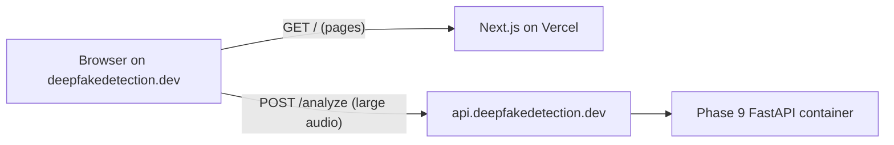

# FASSD Frontend & Deployment Story

**Project:** FASSD — Forensic Acoustics for Synthetic Speech Detection  
**Public product URL:** [https://www.deepfakedetection.dev/](https://www.deepfakedetection.dev/)  
**Document purpose:** Authoritative story of FASSD’s **primary user-facing software deliverable** — the live web platform — and how it connects to the Phase 9 inference backend. Written as the frontend/platform counterpart to `PROJECT_STORY_FROM_DAY_ONE.md`.  
**Repository:** This website lives in a **separate hosting repository** (documented path `D:\FASSD\`) — **not** in the FYP ML git repo (`E:\FYP`).  
**Status at the end of this document:** **Production web app live** at https://www.deepfakedetection.dev/ — Next.js on Vercel, Phase 9 FastAPI on DigitalOcean, Firebase auth/history, direct browser uploads for large audio files, multi-axis forensic results UI.  
**Thesis note:** For thesis writing, treat this online platform as the main software representation of FASSD. The FYP repo `release/` folder is the ML backend **source**; it is not the primary user interface story.

---

## 1. The Whole Story in One Paragraph

The web platform started as a Next.js marketing site with a dashboard that called a local **Hybrid ResNet** inference API and showed a simple REAL/FAKE verdict. As the backend evolved into a **Phase 9 multi-axis forensic system** (`new backend/release/`), the frontend had to change too: it stopped being a binary spoof screener and became a **voice integrity console** that shows four separate evidence checks, a real audio waveform, segment highlights, and safe manual-review wording. The app was deployed on **Vercel** at **deepfakedetection.dev**, the inference API on a **DigitalOcean Droplet** using Docker + Caddy, and user accounts/history on **Firebase**. The hardest integration problems were CORS/proxy routing, Vercel’s **4.5 MB upload limit** on serverless routes, missing vendored backend modules in the standalone release folder, and keeping the UI honest — not claiming court-ready proof while still being readable for demo users and thesis defense.

---

## 2. How This Document Relates to the Backend Story

| Document | Author focus | Scope |
| --- | --- | --- |
| `PROJECT_STORY_FROM_DAY_ONE.md` | Backend / ML / forensic research arc | Datasets, models, phases 1–9, fusion, limitations |
| **This document** | Frontend / platform / deployment arc | Next.js UI, API wiring, Vercel, DigitalOcean, Firebase, production issues |

The backend story explains **why** the system became multi-axis. This document explains **how users interact with it on the web** and **how the live stack is wired**.

---

## 3. Original Frontend Scope

The first website goal was straightforward:

1. **Landing page** — explain the project, show technology sections, drive users to the dashboard.
2. **Authentication** — email/password and Google sign-in via Firebase.
3. **Dashboard** — upload an audio file and see detection results.
4. **Profile / history** — optional saved analyses in Firestore.

The first inference integration assumed:

- a single **binary** output (`REAL` / `FAKE`),
- a **Hybrid ResNet + environmental features** backend,
- chunk voting and multiclass attack hints,
- local dev: Next.js on port **3000**, FastAPI on port **8000**.

That assumption is now **legacy**. The active backend is Phase 9 in `new backend/release/`.

---

## 4. Technology Stack (Current)

### 4.1 Frontend

| Layer | Choice | Why |
| --- | --- | --- |
| Framework | **Next.js 16** (App Router) | SSR/SSG, API routes, Vercel-native deploy |
| UI | **React 19**, **Tailwind CSS 4**, **shadcn/ui** | Fast polished UI, dark forensic theme |
| Fonts | Geist Sans, Geist Mono, Orbitron | Marketing + technical/console feel |
| Motion | `motion`, custom reveal components | Landing page polish |
| 3D / visuals | Three.js globe, canvas waveform | Hero + results visualization |
| Analytics | `@vercel/analytics` | Basic traffic on production |

### 4.2 Auth & data

| Service | Role |
| --- | --- |
| **Firebase Auth** | Sign up, sign in, Google OAuth |
| **Firestore** | `users/{uid}`, `audioAnalyses/{id}` history |
| **Firebase rules** | Per-user read/write only (`firestore.rules`) |

### 4.3 Inference (production)

| Layer | Host | Role |
| --- | --- | --- |
| **Next.js** | Vercel | UI, optional proxy route |
| **Phase 9 FastAPI** | DigitalOcean Droplet | `/analyze`, `/health`, four-axis forensic API |
| **Caddy** | Same Droplet | HTTPS reverse proxy to API container |
| **WavLM + joblib models** | Droplet volumes | Origin/replay/mixer/partial models |

---

## 5. Repository Layout (What the Frontend Owns)

```text
D:\FASSD\
├── app/                              # Next.js App Router
│   ├── page.tsx                      # Landing (home sections)
│   ├── dashboard/page.tsx            # Upload + analysis flow
│   ├── profile/page.tsx              # User history
│   ├── signin/ , signup/             # Auth pages
│   ├── layout.tsx                    # Root layout + AuthProvider
│   ├── globals.css                   # Theme tokens, glass effects
│   └── api/inference/[...path]/      # Server-side proxy to backend
├── components/
│   ├── detection-results.tsx         # Phase 9 results UI
│   ├── upload-zone.tsx               # Drag-and-drop upload
│   ├── analysis-processing.tsx       # In-progress state + waveform
│   ├── audio-waveform-display.tsx    # Real file waveform + highlights
│   ├── dashboard-sidebar.tsx         # Stats + Phase 9 pipeline card
│   ├── home-sections.tsx             # Landing page sections
│   └── ui/                           # shadcn primitives
├── lib/
│   ├── inference-client.ts           # POST /analyze
│   ├── inference-url.ts              # Base URL resolution
│   ├── inference-response-mapper.ts  # Phase 9 JSON → UI model
│   ├── detection-types.ts            # Shared result types
│   ├── verdict-labels.ts             # User-facing verdict copy
│   ├── extract-audio-peaks.ts        # Browser-side waveform decode
│   ├── firebase.ts                   # Firebase init
│   ├── firestore.ts                  # History CRUD
│   ├── auth-context.tsx              # Auth provider
│   └── project-facts.ts              # Marketing copy aligned to Phase 9
├── deploy/
│   ├── DEPLOY_DIGITALOCEAN.md        # Backend deploy runbook
│   └── Caddyfile                     # HTTPS reverse proxy
├── new backend/release/              # Active Phase 9 API (separate story)
├── firestore.rules
├── .env.example
├── .env.local                        # Local secrets (gitignored)
└── next.config.mjs                   # Mirrors INFERENCE_PROXY_TARGET to client
```

**Intentionally not pushed to GitHub** (see `.gitignore`):

- `FYP_FASSD-main/` — old training codebase
- `inference_api/` — legacy Hybrid ResNet API
- `model/` — old TorchScript checkpoint + scripts
- `.venv/`, `node_modules/`, `.env.local`
- `*.joblib` model weights (upload to Droplet manually)
- `Samples/`, audio files, generated reports

---

## 6. Page-by-Page Product Story

### 6.1 Landing (`app/page.tsx`)

Built as a full marketing funnel, not just a login screen:

- **Hero** — “Forensic Acoustics” branding, CTA to dashboard
- **Intro** — explains multi-axis Phase 9 checks (not Hybrid ResNet chunk voting)
- **Architecture bento** — four experimental evidence models
- **Pipeline timeline** — decode → segment → features → four models → fuse
- **Capabilities / use cases** — media verification, research demo, triage
- **Footer** — links to dashboard and architecture section

Copy was updated to match the **current backend**, removing outdated “Hybrid ResNet + Phase 6 voting” language.

### 6.2 Dashboard (`app/dashboard/page.tsx`)

The core product flow:

1. User uploads audio (`UploadZone`)
2. UI shows processing steps (`AnalysisProcessing`) with real waveform preview
3. Frontend POSTs file to inference API
4. Response mapped into `DetectionResult`
5. Results rendered (`DetectionResults`)
6. Optional save to Firestore if signed in

States handled:

- processing
- success (Phase 9 evidence cards + waveform)
- error (API down, payload too large, fusion failure, timeout)

### 6.3 Results (`components/detection-results.tsx`)

Redesigned from an old “forensic report / confidence ring / multiclass” layout to:

- **Real audio waveform** at the top (not a fake animated bar chart)
- **Plain headline** — e.g. “Sounds human-made”, “Worth a closer look”
- **Four check cards** — voice source, replay, channel/mix, edited segments
- **Signal strength bars** — per-axis glance view
- **Moments to replay** — timestamp list for partial segment candidates
- **Safety disclaimer** from backend `safety.wording`

The UI still maps Phase 9 into a simplified screening tag for history/Firestore compatibility, but the on-screen copy prioritizes **evidence indicators**, not legal verdicts.

### 6.4 Profile (`app/profile/page.tsx`)

Shows saved `audioAnalyses` from Firestore for the signed-in user. Depends on published `firestore.rules` — early production had `allow read, write: if false` until rules were deployed.

---

## 7. Backend Migration: Legacy → Phase 9

This was the largest frontend integration change.

### 7.1 Before (legacy)

| Item | Value |
| --- | --- |
| Backend folder | `inference_api/` |
| Model | Hybrid ResNet TorchScript |
| Endpoint | `POST /analyze` |
| Response | `prediction: REAL \| FAKE`, `attack_probs`, chunk metrics |
| UI | Binary verdict, multiclass hints, Phase 6 wording |

### 7.2 After (current)

| Item | Value |
| --- | --- |
| Backend folder | `new backend/release/` |
| Models | 4 joblib axis models + WavLM SSL |
| Endpoint | `POST /analyze` (alias) / `POST /analyze-audio` |
| Response | `voice_origin_result`, `evidence_axis_cards`, `user_summary`, `phase9c_report`, `partial_fabrication` |
| UI | Multi-axis cards, waveform highlights, manual-review wording |

### 7.3 Mapping layer (`lib/inference-response-mapper.ts`)

The mapper detects response shape:

- **Phase 9** if `voice_origin_result` exists or `processing_status` without `prediction`
- **Legacy** if `prediction: REAL | FAKE` exists

Phase 9 mapping pulls from:

- `user_summary.voice_origin_text`
- `user_summary.plain_language_explanation`
- `evidence_axis_cards[]`
- `partial_fabrication.top_segments[]`
- `phase9c_report` axis probabilities

This let the dashboard work during migration without breaking old local setups immediately.

---

## 8. How the Frontend Talks to the Backend

### 8.1 Request flow (production)



For **large audio uploads**, the browser calls the DigitalOcean API **directly**.  
For **small health checks** or local dev, `/api/inference` proxy can still be used.

### 8.2 URL resolution (`lib/inference-url.ts`)

```text
If NEXT_PUBLIC_INFERENCE_URL is set → browser calls that host directly
Else → browser calls /api/inference (Next.js proxy)
```

`next.config.mjs` mirrors `INFERENCE_PROXY_TARGET` into `NEXT_PUBLIC_INFERENCE_URL` at build time so production uploads bypass Vercel’s body limit automatically.

### 8.3 Proxy route (`app/api/inference/[...path]/route.ts`)

Server-side forwarder:

- reads `INFERENCE_PROXY_TARGET` (default `http://127.0.0.1:8000`)
- proxies GET/POST to backend
- `maxDuration = 300` seconds for long scans (~100s observed locally)

**Limitation discovered in production:** Vercel serverless routes reject request bodies larger than ~**4.5 MB** (`FUNCTION_PAYLOAD_TOO_LARGE`). This broke uploads like a 4.3 MB MP3 when routed through the proxy.

**Fix:** direct browser → DigitalOcean upload + backend CORS.

### 8.4 Inference client (`lib/inference-client.ts`)

- Builds `FormData` with `file`
- POSTs to `${getInferenceBase()}/analyze`
- 10-minute client timeout
- Parses API errors including payload-too-large messaging

---

## 9. Environment Variables

### 9.1 Local (`.env.local`, gitignored)

```env
NEXT_PUBLIC_FIREBASE_API_KEY=...
NEXT_PUBLIC_FIREBASE_AUTH_DOMAIN=fassd-534e0.firebaseapp.com
NEXT_PUBLIC_FIREBASE_PROJECT_ID=fassd-534e0
NEXT_PUBLIC_FIREBASE_STORAGE_BUCKET=fassd-534e0.firebasestorage.app
NEXT_PUBLIC_FIREBASE_MESSAGING_SENDER_ID=...
NEXT_PUBLIC_FIREBASE_APP_ID=...

# Optional for local proxy mode:
INFERENCE_PROXY_TARGET=http://127.0.0.1:8000
```

### 9.2 Vercel (production)

| Variable | Example | Purpose |
| --- | --- | --- |
| `NEXT_PUBLIC_FIREBASE_*` | same as local | Auth + Firestore |
| `INFERENCE_PROXY_TARGET` | `https://api.deepfakedetection.dev` | Backend URL; mirrored to client bundle |

Usually **do not** set `NEXT_PUBLIC_INFERENCE_URL` manually — `next.config.mjs` derives it from `INFERENCE_PROXY_TARGET`.

### 9.3 DigitalOcean backend (`.env.production`)

```env
CADDY_DOMAIN=api.deepfakedetection.dev
CORS_ALLOW_ORIGINS=https://www.deepfakedetection.dev,https://deepfakedetection.dev
HF_HUB_DISABLE_SYMLINKS_WARNING=1
```

---

## 10. Firebase Integration

### 10.1 Auth (`lib/auth-context.tsx`)

Supports:

- email/password sign up and sign in
- Google sign-in
- user profile document in `users/{uid}`

### 10.2 Firestore history (`lib/firestore.ts`)

Collection: `audioAnalyses`

Saved fields after each scan:

- filename, fileSize, duration
- simplified `isDeepfake`, `confidence`, `attackType`
- axis detail percentages for dashboard history cards
- `userId`, `createdAt`

### 10.3 Security rules (`firestore.rules`)

```javascript
match /users/{userId} {
  allow read, write: if request.auth != null && request.auth.uid == userId;
}
match /audioAnalyses/{analysisId} {
  allow read, write: if request.auth != null && request.auth.uid == resource.data.userId;
  allow create: if request.auth != null && request.auth.uid == request.resource.data.userId;
}
```

### 10.4 Production checklist

1. Add `www.deepfakedetection.dev` and `deepfakedetection.dev` to Firebase **Authorized domains**
2. Publish Firestore rules in Firebase Console
3. Keep `.env.local` out of git

---

## 11. Deployment Story

### 11.1 Frontend — Vercel

1. Push repo to GitHub (with `.gitignore` excluding secrets and model weights)
2. Import project in Vercel (root = where `package.json` lives)
3. Set environment variables (Firebase + `INFERENCE_PROXY_TARGET`)
4. Deploy
5. Connect custom domain **deepfakedetection.dev**

Build notes:

- `next.config.mjs` currently ignores ESLint/TS build errors for deploy resilience (should be tightened later)
- Node >= 20.9 required

### 11.2 Backend — DigitalOcean

Full runbook: `deploy/DEPLOY_DIGITALOCEAN.md`

Summary:

1. Claim GitHub Student Pack **$200** DigitalOcean credit
2. Create **4 GB RAM** Ubuntu Droplet
3. Point `api.deepfakedetection.dev` → Droplet IP
4. SSH in, install Docker
5. Clone repo to `/opt/fassd`
6. Upload `new backend/release/models/**/*.joblib` (not in git)
7. Copy `.env.production.example` → `.env.production`
8. Run `docker compose up -d --build` in `new backend/release/`
9. Verify `curl https://api.deepfakedetection.dev/health` → `ready_for_analyze: true`

Docker services:

| Service | Role |
| --- | --- |
| `api` | Phase 9 FastAPI on internal port 8000 |
| `caddy` | HTTPS on 443 → reverse proxy to `api` |

### 11.3 GitHub hygiene

`.gitignore` excludes:

- legacy folders: `FYP_FASSD-main/`, `inference_api/`, `model/`
- secrets: `.env.local`, credentials
- heavy artifacts: `*.joblib`, audio samples, `.venv/`, `node_modules/`
- IDE: `.cursor/`

---

## 12. Production Issues We Hit (and Fixes)

| Symptom | Cause | Fix |
| --- | --- | --- |
| `Failed to fetch` locally | Backend not running / wrong port | Run `new backend/release/run_fastapi.ps1`, proxy to `:8000` |
| Firestore permission denied | Rules not published | Deploy `firestore.rules` |
| Analysis failed: `phase8f_fusion_rules` missing | Release folder not fully vendored | Added `src/phase8_fusion/phase8f_fusion_rules.py` |
| `ready_for_analyze: false` | WavLM still downloading on first boot | Wait; optional `HF_TOKEN` on Droplet |
| `FUNCTION_PAYLOAD_TOO_LARGE` on Vercel | Audio sent through `/api/inference` proxy | Direct upload to DO API; set `INFERENCE_PROXY_TARGET`; mirror to client in `next.config.mjs` |
| UI showed Hybrid ResNet pipeline | Stale marketing/sidebar copy | Updated `project-facts.ts`, `dashboard-sidebar.tsx`, `home-sections.tsx` |
| Chunks 0/0 with 200 OK | API returned `processing_status: error` in JSON | Fixed backend fusion import; improved error surfacing in UI |
| CORS errors (if direct API) | Backend missing frontend origin | Set `CORS_ALLOW_ORIGINS` on Droplet |

---

## 13. UI / UX Evolution

### 13.1 Version 1 — Binary screening console

- “REAL / FAKE” badges
- Confidence ring
- Multiclass distribution bars
- “Hybrid ResNet + environmental branch” pipeline sidebar
- Decorative animated waveform (not real audio)

### 13.2 Version 2 — Phase 9 voice integrity console (current)

- Headline: “Sounds human-made” / “Worth a closer look”
- Real waveform from uploaded file (`extract-audio-peaks.ts` + `AudioWaveformDisplay`)
- Amber highlight bands for segment candidates
- Four cards: Voice source, Recording chain, Channel & mix, Edited segments
- “What to do next” recommendation box
- Safety footer from backend
- Sidebar pipeline updated to Phase 9 steps

Design goal: **readable demo for judges and users**, without claiming court-ready proof.

---

## 14. What the User Sees vs What the API Returns

The backend follows forensic-safe wording (see `new backend/release/docs/FORENSIC_REPORT_WORDING.md`):

- evidence indicators
- experimental prototype
- manual review recommended
- no `fake_score` / `real_score`

The frontend simplifies for display but should not over-claim. Current mapping:

| API field | UI usage |
| --- | --- |
| `user_summary.voice_origin_text` | Main headline |
| `user_summary.plain_language_explanation` | Summary paragraph |
| `user_summary.recommendation_text` | “What to do next” |
| `evidence_axis_cards[]` | Four check cards |
| `partial_fabrication.top_segments[]` | Waveform highlights + “Moments to replay” |
| `safety.wording` | Footer disclaimer |
| `phase9c_report.fusion_status` | Available in API; can be surfaced more explicitly in UI |

---

## 15. Developer Setup (Website Repo — Optional)

Production is the reference environment (§16). Local dev in the **separate website repo** is for maintainers only — not the thesis-facing software story.

- Backend dev: `new backend/release/run_fastapi.ps1` in website repo
- Frontend dev: `npm run dev` → `http://localhost:3000/dashboard`
- See `.env.example` for Firebase and proxy variables

---

## 16. End-to-End Test Checklist (Production)

1. `https://www.deepfakedetection.dev` loads landing page
2. Sign in works (Firebase authorized domains configured)
3. `https://api.deepfakedetection.dev/health` returns `ready_for_analyze: true`
4. Upload MP3/WAV on dashboard
5. Network tab shows analyze request going to **api.deepfakedetection.dev** (not blocked at 4.5 MB)
6. Results show waveform + four axis cards
7. History saves when logged in (Firestore rules published)

---

## 17. Cost & Hosting Summary

| Resource | Host | Approx. cost |
| --- | --- | --- |
| Frontend | Vercel Hobby | $0 for demo |
| Backend API | DigitalOcean 4GB Droplet | ~$24/mo (covered by $200 student credit) |
| Auth/DB | Firebase Spark | $0 within free tier |
| Domain | Registrar | varies |
| Model weights | Droplet disk | uploaded manually, not on GitHub |

GitHub Student Pack DigitalOcean credit expires **July 31, 2026** — destroy the Droplet when the demo period ends to avoid billing.

---

## 18. Known Limitations (Platform Side)

1. **Vercel proxy is not for large uploads** — use direct API URL for `/analyze`.
2. **Long scans (~100s+)** — requires generous timeouts on client and Vercel function duration.
3. **Firestore history stores simplified fields** — not the full Phase 9 JSON report.
4. **UI still derives a binary `isDeepfake` flag** for history compatibility — full multi-axis nuance is in the results view, not the history list.
5. **No server-side audio storage** — files are processed in memory; not retained after analysis.
6. **Production depends on manual model upload** — `.joblib` files are not in the git repo.

---

## 19. Files to Read Next

| Path | Why |
| --- | --- |
| `deploy/DEPLOY_DIGITALOCEAN.md` | Step-by-step backend deploy |
| `.env.example` | All env vars documented |
| `lib/inference-response-mapper.ts` | API → UI mapping |
| `components/detection-results.tsx` | Current results UI |
| `new backend/release/docs/FORENSIC_REPORT_WORDING.md` | Safe wording contract |
| `PROJECT_STORY_FROM_DAY_ONE.md` | Full ML/backend research story |

---

## 20. Closing Statement

The frontend work was not “just a website.” It was the product layer that made the Phase 9 forensic backend understandable: upload audio, see a real waveform, read four separate evidence checks, and get honest manual-review guidance. The deployment split — **Vercel for UI**, **DigitalOcean for inference** — matches the constraints of each platform: static/SSR frontend on the edge, heavy PyTorch + WavLM API on a VM. The main lesson from production was architectural: **never route large audio through Vercel serverless proxies**; let the browser talk to the inference API directly, and keep the wording aligned with experimental forensic evidence — not a fake/real certificate.

That is the current state of FASSD as a live demo at [deepfakedetection.dev](https://www.deepfakedetection.dev/), connected to the Phase 9 release backend, documented for handoff, thesis defense, and future teammates.
